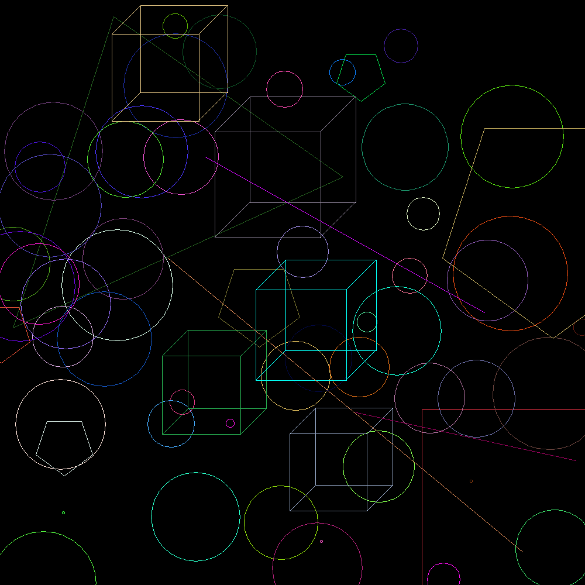

# [Jart](https://github.com/01-edu/public/tree/master/subjects/java/raids/Jart) 

## Description

Jart is a Java-based project aimed at generating an image composed of various geometrical shapes. The shapes, including rectangles, triangles, pentagons, cubes and circles are drawn on a canvas and saved as a PNG file (`image.png`). The project showcases the use of Java's `java.awt` package for drawing shapes and handling images.

## Features

- Implements two main interfaces: `Displayable` and `Drawable`.
    - `Displayable` interface defines methods for displaying pixels on a canvas and saving the image.
    - `Drawable` interface allows different shapes to be drawn and assigns each shape a random color.
- Supports drawing of various shapes:
    - **Points**: Drawn at specified `x` and `y` coordinates.
    - **Lines**: Defined by start and end points.
    - **Rectangles**: Defined by two corner points.
    - **Triangles**: Defined by three points.
    - **Circles**: Defined by a center point and radius.
    - **Pentagon**: A five-sided polygon, defined by a center point and side length, with vertices calculated using trigonometric functions.
    - **Cube**: A 3D illusion created by drawing two offset squares and connecting corresponding vertices, defined by a center point and side length.
- Shapes are randomly generated and drawn in random colors, with coordinates and dimensions randomized within canvas bounds.
- The resulting image, containing all shapes, is saved as `image.png`.


## Project Structure

### Interfaces

- **Displayable**: Interface that defines the methods to display pixels and save the image.
- **Drawable**: Interface that defines methods to draw shapes and retrieve their color.

### Classes

- **Main**: The entry point of the program, which creates an image and draws multiple shapes on it.
- **Image**: Implements the `Displayable` interface. It is responsible for drawing pixels on a canvas (using a `BufferedImage`) and saving the final image to a file.
- **Point**: Represents a point on the canvas, defined by `x` and `y` coordinates.
- **Line**: Represents a line between two points.
- **Rectangle**: Represents a rectangle, defined by two corner points.
- **Triangle**: Represents a triangle, defined by three points.
- **Circle**: Represents a circle, defined by a center point and a radius.
- **Pentagon**: Represents a pentagon, defined by a center point and a distance representing the length of each side. It calculates five vertices around the center to form the pentagon shape and renders it on the canvas.
- **Cube**: Represents a cube in a 2D view to create a 3D illusion. It is defined by a center point and a distance for the size of its sides. The cube is drawn by creating two squares offset from each other and connecting corresponding vertices to form the illusion of depth.

## Usage

### How to Run

1. Clone or download the project to your local machine.
2. Compile the project:

    ```bash
    javac *.java -d build
    ```

3. Run the project:

    ```bash
    java -cp build Main
    ```

4. Once the program completes, a file named `image.png` will be created in the project's directory. This file contains the generated image with shapes.

### Example Output


The output image will contain a combination of the following shapes in different colors:
- Lines
- Rectangles
- Triangles
- Circles
- Pentagons
- Cubes

Each shape will be drawn at random locations and will have a random color.

## Dependencies

- Java Development Kit (JDK) 8 or higher.
- Java's built-in `java.awt` and `javax.imageio` packages for image creation and manipulation.

# Contributors

- [Ingvar Leerimaa 👑](https://01.kood.tech/git/IngvarLeerimaa)
- [Thomas Visnap](https://01.kood.tech/git/Thomas)
- [Juss Märtson](https://01.kood.tech/git/juss)
- [Iryna Velychko](https://01.kood.tech/git/ivelychk)
