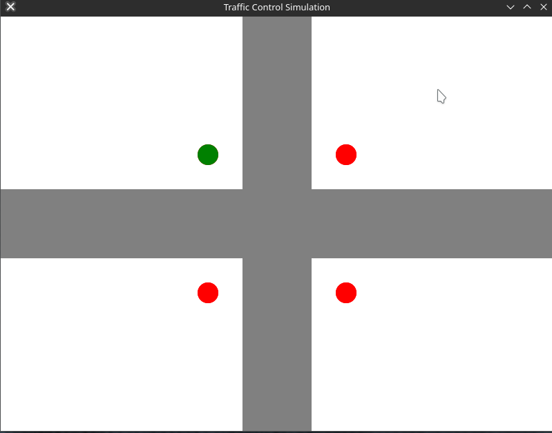

# [Jraffic](https://github.com/01-edu/public/tree/master/subjects/java/raids/jraffic)

## Project Overview
This project is a traffic control simulation designed to address traffic congestion in urban areas. The simulation includes a graphical representation of intersecting roads, vehicles, and traffic lights. Vehicles move according to set traffic rules, maintaining a safe distance from other vehicles and obeying traffic lights.

The goal of this project is to simulate the management of traffic flow using traffic lights to prevent congestion and collisions at an intersection.

## Features
- **Roads**: Two intersecting roads with single lanes in both directions (north, south, east, and west).
- **Traffic Lights**: Traffic lights with red and green signals, dynamically controlling the traffic at the intersection.
- **Vehicles**: Cars move through the intersection following predetermined routes (straight, left turn, or right turn).
- **Safe Distance**: Vehicles automatically stop if another vehicle is too close or if the traffic light is red.
- **Keyboard Controls**: Use keyboard keys to spawn vehicles at various entry points to the intersection.

## Controls
- **↑ Up Arrow**: Spawns a vehicle moving from the south towards the intersection.
- **↓ Down Arrow**: Spawns a vehicle moving from the north towards the intersection.
- **→ Right Arrow**: Spawns a vehicle moving from the west towards the intersection.
- **← Left Arrow**: Spawns a vehicle moving from the east towards the intersection.
- **r Key**: Spawns a vehicle moving from a random direction.
- **Esc Key**: Exits the simulation.

## Traffic Rules
- Vehicles follow the color-coded route that was assigned upon spawning:
  - **Straight**: The vehicle continues straight through the intersection.
  - **Left Turn**: The vehicle makes a left turn at the intersection.
  - **Right Turn**: The vehicle makes a right turn at the intersection.
- Vehicles stop when a red light is active and move when the light turns green.
- Vehicles maintain a safe distance to avoid collisions.

## Requirements
- Java 23 or newer
- JavaFX 23 or newer

## Collaborators

- [Ingvar Leerimaa 👑](https://01.kood.tech/git/IngvarLeerimaa)
- [Thomas Visnap](https://01.kood.tech/git/Thomas)
- [Iryna Velychko](https://01.kood.tech/git/ivelychk)
